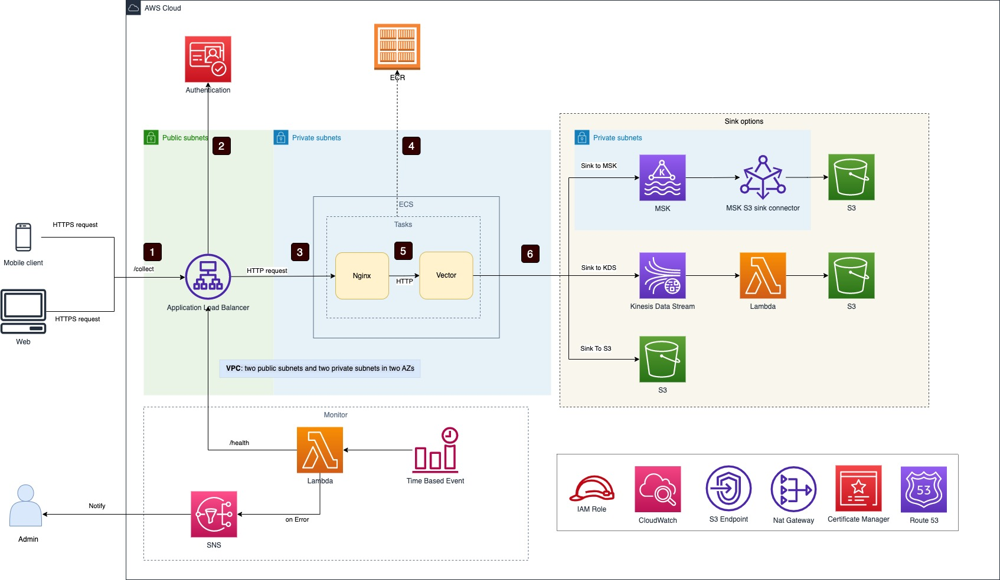

# AWS ClickStream solution - Server Ingestion

## Architecture



1. Requests are sent by web or mobile clients to AWS application load balancer
2. (Optional) AWS application load balancer verifies client token
3. AWS application load balancer forwards requests to Nginx endpoint in ECS service
4. ECS service loads Nginx and Vector images from ECS and start them within an ECS task (only one time during deployment)
5. Nginx server forwards requests to Vector server via HTTP
6. Vector server sinks data to MSK, Kinesis Data Stream or S3 based on configuration

## How to deploy

### Prerequisites

1. Follow this [doc](https://docs.aws.amazon.com/cdk/v2/guide/getting_started.html) to setup AWS CDK
2. Install Docker in your machine
3. Run below commands to install npm packages 

```sh
cd src
npm install
```

### Deploy


1. Deploy VPC, MSK cluster and ingestion server separately

```sh
cd src

# create a new VPC
cdk deploy clickstream-vpc 

# create infra, such as S3 bucket
cdk deploy clickstream-infra

# create a new MSK cluster
cdk deploy cs-msk-small

# create Msk S3 sink connector
cdk deploy cs-msk-s3-sink-small

# deploy the ingestion server using the VPC and MSK cluster created in steps above, we use vector to send data to MSK
cdk deploy cs-server-ec2-vector
```

2. Use your own VPC and MSK cluster

 You can add `vpcId` and `mskBrokers` to an existing stack then deploy it.

 Note: 
  
- Your VPC must have at least 2 AZs(one public subnet, or one public public and one private subnet with egress in each AZ)
- Your MSK cluster should be in the same VPC
- Security group of MSK cluster should allow access from the security group of ECS cluster

```typescript
new ServerIngestionStack(app, "cs-server-ec2-vector", {
  vpcId: "<vpc-xxxx>",
  profile: {
    tier: TierType.SMALL,
    deliverToMSK: true,
    serviceType: ServiceType.ECS_EC2_NGINX_VECTOR,
  },

  mskConfig: {
    mskBrokers: "<broker1,broker2,broker3>",
    mskTopic: "<kafka-topic>",
    mskSecurityGroupId: "<mskSecurityGroupId>",
    mskClusterName: "<mskClusterName>",
  },
  env: {
    region: process.env.CDK_DEFAULT_REGION,
    account: process.env.CDK_DEFAULT_ACCOUNT,
  },
});

```

Then run below commands to deploy:

```sh
cd src

# deploy 
cdk deploy cs-server-ec2-vector
```

3. Fully custom your deployment


Add a section code like below in file: `src/bin/app.ts`

```typescript

new ServerIngestionStack(app, "cs-server-custom-test", {
  vpcId: "<vpc-xxxx>",
  profile: {
    tier: TierType.SMALL,
    deliverToMSK: true,
    serviceType: ServiceType.ECS_EC2_NGINX_VECTOR,
  },

  mskConfig: {
    mskBrokers: "<broker1,broker2,broker3>",
    mskTopic: "<kafka-topic>",
    mskSecurityGroupId: "<mskSecurityGroupId>",
    mskClusterName: "<mskClusterName>",
  },
  env: {
    region: process.env.CDK_DEFAULT_REGION,
    account: process.env.CDK_DEFAULT_ACCOUNT,
  },
});

```

You can change `profile.tier` to one of `TierType.XSMALL|SMALL|MEDIUM|LARGE`.

Configurations for each tier are defined in file: `src/lib/config.ts`, you can fully custom them.

Then run below commands to deploy:

```sh
cd src

# deploy the stack
cdk deploy cs-server-custom-test
```


## Q&A

1. How to change server(ALB) endpoint path and port?

   The default path is `/collect`, you can config it by changing function `serverEndpointPath()` in `src/lib/config.ts`

   The default port is `80`, you can config it by changing function `serverEndpointPort()` in `src/lib/config.ts`

2. How to custom Msk configuration? 
   
    Change return value of below functions in `src/lib/config.ts`
    - getMskSetting()

3. How to custom EC2 autoscaling group?
    
    Change return value of below functions in `src/lib/config.ts`
    - getEcsEc2NginxAndVectorAsgSetting()
   
4. How to change AZs of ingestion server and ALB(application load balancer)? 
    
    Change return value of below functions in `src/lib/vpc.ts`
    - getAppAZs()  // AZs of ingestion server
    - getALBAZs()   // AZs of application load balancer

5. Can I deploy the solution in a VPC which only has two public subnets? 
   
   Yes. The solution will try to find private subnets with egress in your VPC, if not found, it will be deployed in public subnets.

6. Can I deploy the solution in a VPC which only has one public subnet?
   
   No. At lease two AZs required for ALB(application load balancer).

7. Can I deploy the ingestion server in only one subnet?
   
   Yes. By default, the ingestion server will be deployed in two subnets, you can change `getAppAZs()` in `src/lib/vpc.ts` to one AZ.

8. Can I deploy the ingestion server in only one subnet and ALB(application load balancer) in two subnets?
   
   Yes.

